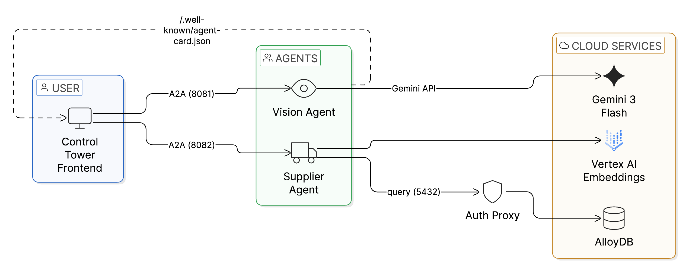

# Autonomous Supply Chain with Gemini 3 Flash & AlloyDB AI

Build an **agentic supply chain system** that "sees" physical inventory using Gemini 3 Flash (Code Execution), "remembers" millions of parts using AlloyDB AI (ScaNN), and "transacts" using the A2A Protocol.

## What You'll Build

A multi-agent system featuring:
- **Vision Agent**: Uses Gemini 3 Flash (LOW thinking) to count inventory items deterministically via code execution, plus Gemini 2.5 Flash Lite for smart query generation with structured outputs
- **Supplier Agent**: Searches millions of parts using AlloyDB ScaNN vector search with real semantic embeddings (Vertex AI text-embedding-005)
- **Control Tower**: Real-time WebSocket UI with automatic image compression for orchestrating autonomous workflows

## Architecture



**Key Components:**
- **Control Tower (port 8080):** WebSocket-based UI with automatic image compression for real-time orchestration
- **Vision Agent (port 8081):** Gemini 3 Flash (LOW thinking) with Code Execution + Gemini 2.5 Flash Lite for query generation (API key)
- **Supplier Agent (port 8082):** AlloyDB ScaNN vector search with real semantic embeddings from Vertex AI (GCP credentials)
- **AlloyDB AI:** Enterprise PostgreSQL with ScaNN index and text-embedding-005 for semantic understanding
- **A2A Protocol:** Dynamic agent discovery via `/.well-known/agent-card.json`

**Hybrid Architecture:** Vision Agent uses Gemini API (simple setup, free tier available), while Supplier Agent uses GCP services (enterprise-grade, compliance-ready). Image optimization and intelligent query generation happen automatically.

## Quick Start

### Prerequisites

- Google Cloud Project with billing enabled
- Cloud Shell or local environment with:
  - `gcloud` CLI configured
  - Python 3.9+
  - Git

### Setup & Run

```bash
# 1. Clone the repository
git clone https://github.com/MohitBhimrajka/visual-commerce-gemini-3-alloydb.git
cd visual-commerce-gemini-3-alloydb

# 2. Run setup (provisions infrastructure + seeds database)
sh setup.sh

# 3. Start all services
sh run.sh
```

> **📌 Note:** All commands assume you're in the repo root (`visual-commerce-gemini-3-alloydb/`). If commands fail with "No such file", verify your location with `pwd` and navigate back to the repo.

Open http://localhost:8080 to see the Control Tower.

## Repository Structure

```
visual-commerce-gemini-3-alloydb/
├── README.md                    # You are here
├── setup.sh                     # One-click setup script
├── run.sh                       # One-click run script
├── .env.example                 # Environment variables template
│
├── agents/                      # Agentic components
│   ├── vision-agent/            # Gemini 3 Flash vision analysis
│   └── supplier-agent/          # AlloyDB ScaNN inventory search
│
├── frontend/                    # FastAPI + WebSocket Control Tower
│   ├── app.py                   # Main server
│   └── static/                  # Real-time UI
│
├── database/                    # AlloyDB schema & seeding
│   ├── seed.py                  # Database initialization
│   └── seed_data.sql            # Schema definition
│
├── test-images/                 # Sample warehouse images for testing
│
└── logs/                        # Runtime logs (gitignored)
    ├── proxy.log
    ├── vision-agent.log
    ├── supplier-agent.log
    └── frontend.log
```

## What Each Command Does

### `sh setup.sh`

1. **Validates environment** - Checks gcloud, APIs, project settings
2. **Configures AlloyDB** - Prompts for Public IP and authorized networks (Cloud Shell auto-detects, local machine prompts for security settings)
3. **Provisions infrastructure** - Creates AlloyDB instance (~15 min if new)
4. **Seeds database with real embeddings** - Populates inventory with sample data using Google Gen AI SDK and text-embedding-005 (~10 seconds with parallel embedding generation)
5. **Creates ScaNN index** - Builds high-performance vector search index

### `sh run.sh`

1. **Starts AlloyDB Auth Proxy** - Creates secure tunnel to database (auto-detects Public IP for Cloud Shell or local)
2. **Launches Vision Agent** - Port 8081 (Gemini 3 Flash LOW thinking + Gemini 2.5 Flash Lite query generation)
3. **Launches Supplier Agent** - Port 8082 (AlloyDB ScaNN with real semantic embeddings)
4. **Starts Control Tower** - Port 8080 (FastAPI + WebSocket UI with automatic image compression)

## Key Technologies

- **Gemini 3 Flash** - AI model with LOW thinking level and code execution for deterministic vision analysis
- **Gemini 2.5 Flash Lite** - Fast LLM for semantic query generation with structured outputs (Pydantic models)
- **AlloyDB AI** - PostgreSQL-compatible database with ScaNN vector search (10x faster than HNSW)
- **Vertex AI text-embedding-005** - Real semantic embeddings for accurate similarity matching
- **A2A Protocol** - Agent-to-Agent communication standard for plug-and-play agent composition
- **FastAPI** - Modern Python web framework with WebSocket support and PIL-based image compression

## Troubleshooting

### Port conflicts

```bash
lsof -ti:8080 | xargs kill -9
lsof -ti:8081 | xargs kill -9
lsof -ti:8082 | xargs kill -9
```

### AlloyDB connection issues

**Symptom**: `connection to server at 127.0.0.1, port 5432 failed`

```bash
# 1. Check if Auth Proxy is running
ps aux | grep alloydb-auth-proxy

# 2. Check proxy logs
tail -50 logs/proxy.log
```

**Common causes:**

1. **Auth Proxy not running** - Check: `ps aux | grep alloydb-auth-proxy`
2. **Public IP not enabled** - Verify: `gcloud alloydb instances describe INSTANCE_NAME`
3. **Authorized networks not configured (local machine only)**
   - **Cloud Shell**: Works automatically via internal networking
   - **Local machine**: Requires authorized external networks (setup.sh prompts for this)
4. **Wrong password** - Check `.env`: `cat .env | grep DB_PASS`
5. **Port 5432 in use** - Kill existing process: `lsof -ti:5432 | xargs kill -9`

**Fix for local development:**
- Re-run `sh setup.sh` to configure authorized networks
- When prompted, choose option 1 (0.0.0.0/0) for development/testing
- Note: Even with 0.0.0.0/0, Auth Proxy requires valid GCP credentials (ADC) + database password

> **Why do I need the Auth Proxy?** AlloyDB's private IP (172.21.0.x) is only reachable from inside the VPC. The Auth Proxy creates a secure mTLS tunnel from `127.0.0.1:5432` to your AlloyDB instance. It auto-detects Public IP and connects securely.

### Cloud Shell vs Local Development

**Cloud Shell (Recommended)**:
- Automatic networking configuration
- **Custom VPC Note**: If your AlloyDB is in a custom VPC (not "default"), Cloud Shell will automatically use Public IP connection since it cannot reach custom VPCs via private IP
- The setup script auto-detects this and configures the Auth Proxy accordingly

**Local Machine**:
- Requires AlloyDB Public IP enabled
- Requires authorized external networks configured
- During setup, you'll be prompted to:
  - Enable Public IP (secure: mTLS + ADC + password)
  - Configure authorized networks (0.0.0.0/0 for dev, or specific IP for security)

### Agent not responding

```bash
curl http://localhost:8081/health
curl http://localhost:8082/health
curl http://localhost:8080/api/health
```

## Cleanup

To avoid charges, run the cleanup script:

```bash
sh cleanup.sh
```

This stops the Auth Proxy, deletes the AlloyDB cluster, removes any deployed Cloud Run services, and optionally removes local files (binary, logs, `.env`).

If you prefer a manual approach:

```bash
# Replace with your cluster name (check .env for ALLOYDB_CLUSTER and ALLOYDB_REGION)
gcloud alloydb clusters delete YOUR_CLUSTER_NAME \
  --region=YOUR_REGION \
  --force
```

## Technical References

### **Official Documentation & Performance Benchmarks**

**Gemini 3 Flash:**
- Code Execution API: https://cloud.google.com/vertex-ai/generative-ai/docs/model-reference/code-execution-api
- Developer Guide: https://ai.google.dev/gemini-api/docs/gemini-3
- Model Documentation: https://docs.cloud.google.com/vertex-ai/generative-ai/docs/models/gemini/3-flash
- Pricing: https://ai.google.dev/gemini-api/docs/pricing

**AlloyDB ScaNN Performance (All claims verified from official sources):**
- ScaNN vs HNSW Benchmarks: https://cloud.google.com/blog/products/databases/how-scann-for-alloydb-vector-search-compares-to-pgvector-hnsw
  - ✅ 10x faster filtered search (when indices exceed memory)
  - ✅ 4x faster standard search
  - ✅ 3-4x smaller memory footprint
  - ✅ 8x faster index builds
- Understanding ScaNN: https://cloud.google.com/blog/products/databases/understanding-the-scann-index-in-alloydb
- AlloyDB AI Documentation: https://cloud.google.com/alloydb/docs/ai
- Best Practices: https://docs.cloud.google.com/alloydb/docs/ai/best-practices-tuning-scann

**A2A Protocol:**
- Agent cards at `/.well-known/agent-card.json` (emerging standard)
- Standardized agent discovery and communication

**Additional Context:**
- ScaNN is based on 12 years of Google Research and powers Google Search and YouTube at billion-scale
- Released for general availability: October 2024
- First PostgreSQL vector index suitable for million-to-billion vectors